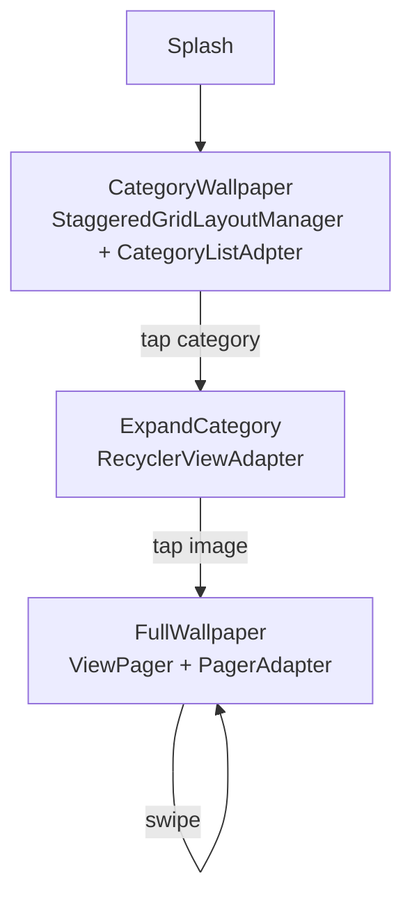

# Wallpaper-App

Android wallpaper browser — splash screen into a staggered-grid category list, drilling into a full-screen, swipeable wallpaper viewer per category, with images pulled directly from hardcoded URLs.

## How it works

`Splash` launches first, then hands off to `CategoryWallpaper`, which renders a `StaggeredGridLayoutManager` `RecyclerView` (via `CategoryListAdpter`) of category thumbnails (e.g. "actor", "marvel", "Anime", "Hot"), each backed by an image URL loaded over the network. Tapping a category opens `ExpandCategory` to browse that category's images, and tapping an image opens `FullWallpaper`, which uses a `ViewPager` + `PagerAdapter` to let the user swipe full-screen through every image in that list starting from the tapped position.

## Architecture

| File | Role |
|---|---|
| `Splash.java` | App entry / splash screen |
| `CategoryWallpaper.java` | Staggered-grid category list |
| `ExpandCategory.java` | Image list within a category |
| `FullWallpaper.java` | Full-screen swipeable wallpaper viewer |
| `adpters/CategoryListAdpter.java`, `RecyclerViewAdapter.java`, `PagerAdapter.java` | RecyclerView/ViewPager adapters |

## Tech stack

Java · Android `RecyclerView` (`StaggeredGridLayoutManager`) · `ViewPager`

## Setup

Open in Android Studio and run on an emulator/device.
